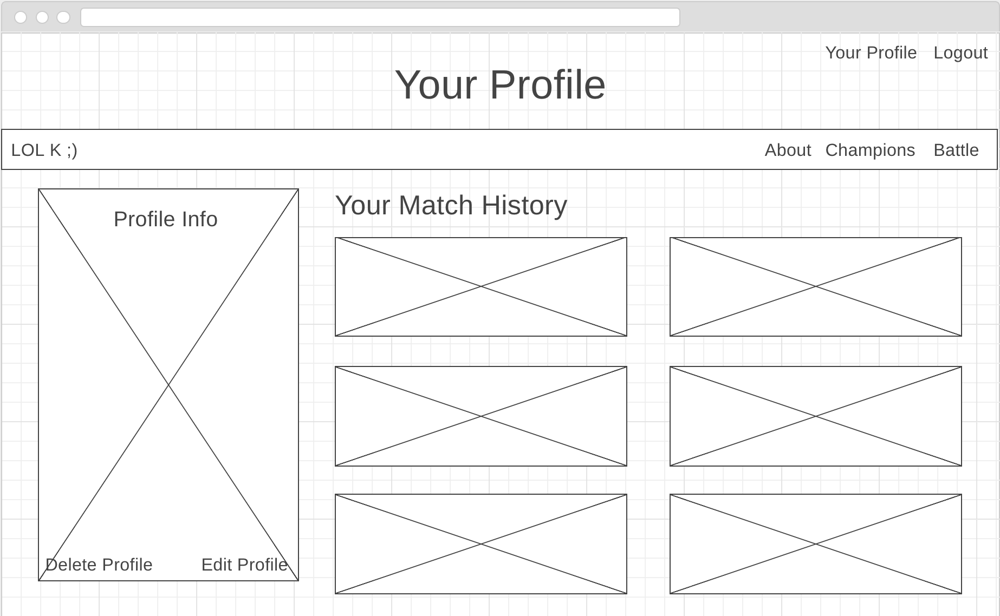

# Project 4 - Full Stack Django App

## Proposal

### Introduction

**LOL K**

LOL K (League of Legends Knockoff) is just a fun silly game that is based off of the classic, "Rock, Paper, Scissors". User will be able to create their own account, pick a "Champion" from the **League of Legends** API, and then go up against a computer generated "Champion". This app will document all wins, draws, and losses per the user's profile.

### Technologies

  * Python, Django, Postgres
  * JQuery
  * Use lectures, Googles, and Docs to research and build this project

### MVP

  * Users must be CRUD
  * Pull and display "Champions" from their free API

### Goals

  * Users can select "Champions" to play against computer
  * History of matches (2nd related table?)
  * Users can message each other or comment on each other's matches(3rd related table?)
  * Display matches on home.html and profile.html

### Stretch Goals

  * Users can search "Champions" by name to go up against computer generated ones
  * Aesthetically appealing page

### Timeline
  * **Monday** - Files organized, tables setup, start working on pulling from API
  * **Tuesday** - Finish API, MVP done, start working on games
  * **Wednesday** - Finish game, display matches, make everything pretty
  * **Thursday** - Make everything pretty, CSS/Bootstrap?, Update Readme

### Wireframes

### Crow's foot diagram of your schema.

